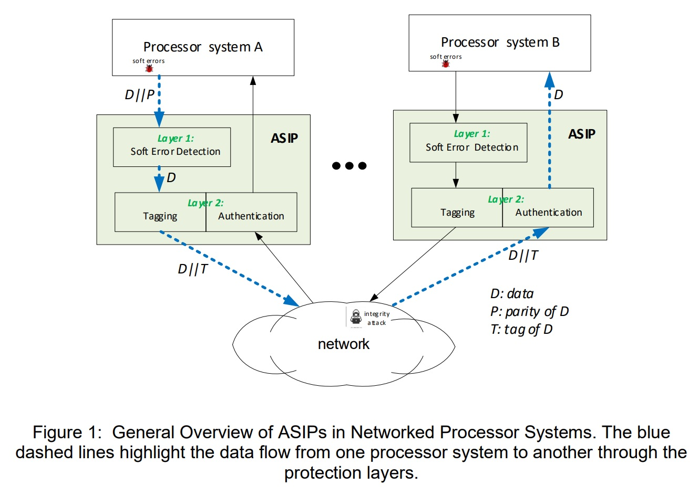
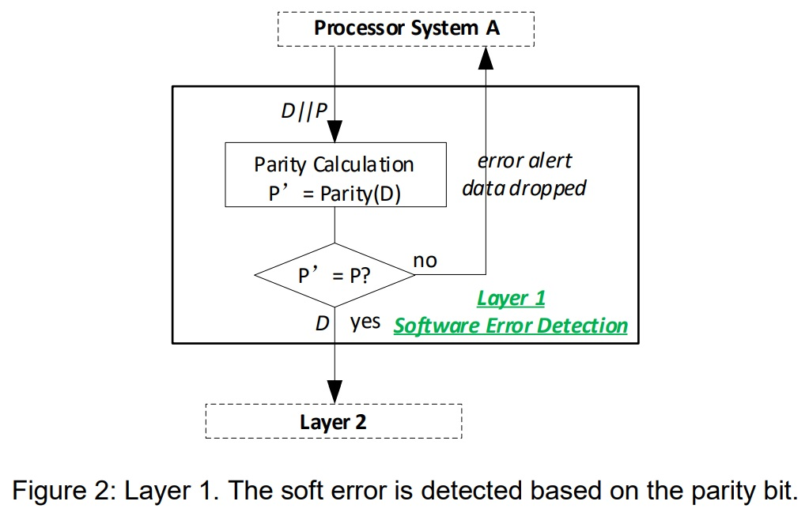
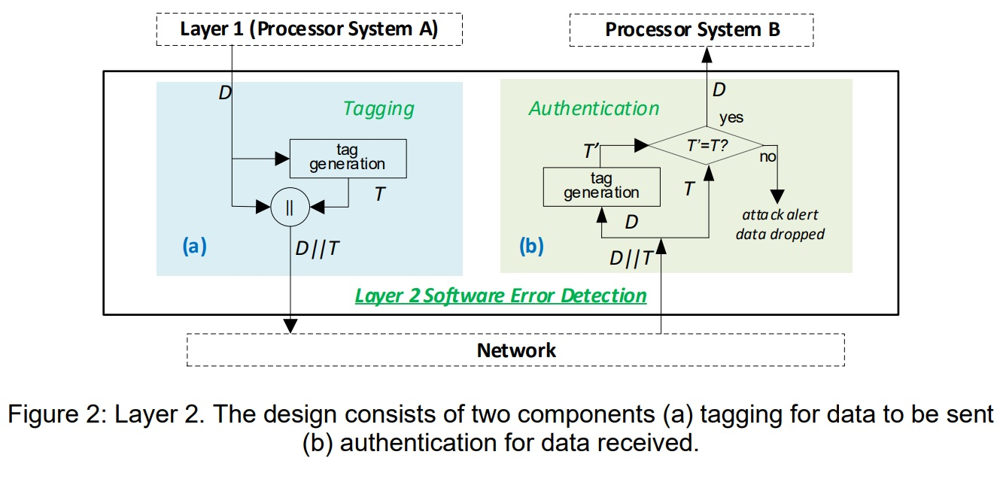
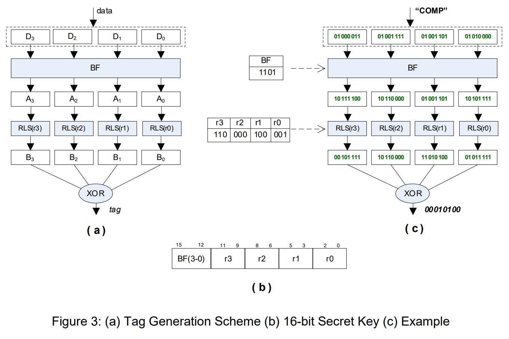

# COMP3211_Assignment
This project is to be completed by your lab groups.
Deliverables for this project contribute to the group report due on Friday, April 23 (Week
10).
## General description
Data integrity is important to the security of networked computing systems. 
The data processed in a processor system may be tarred by **soft errors** 
(for example, a temporary condition in DRAM can unintendedly alter stored data). 
Furthermore, when transferred over the network, the data can be under the **integrity attack** by adversaries.

This project is to design a processor (ASIP) that offers a double-layer protection: 
software error detection (layer 1) and integrity attack detection (layer 2), 
as illustrated in Figure 1. 
The ASIP sits between a processor system and the network to make sure that 
1) the data sent out to the network is soft-error free, and 
2) the data received from the network and to be used by the destination processor is not tampered.

## Layer 1: Software Error detection
Since soft error is not induced by malicious action and the probability of multi-bit error is
very low, we use a parity-based design for 1-bit soft error detection, as shown in Figure
2, where the parity bit (P) of data (D) is generated by the (sender) processor system.

Upon receiving both data and the parity bit, the ASIP checks the data based on the
parity bit. If the parity bit of the received data is the same as the received parity bit, the
data is deemed as error free and will be passed to the next protection layer; Otherwise,
the data is considered to have software error and an alert to the processor system is
generated for resubmission.

## Layer 2: Integrity Attack Detection
For the integrity attack, because it is often skillfully crafted by the attacker, we need to
use a relatively sophisticated approach to counter the attack.

Our design for this layer uses a tag-based approach. It consists of two operational
components: 1) Tagging, to attach a tag to the data to be sent to the network, and 2)
Authentication, to check the authenticity of the data received from the network. Both
components work in pair (one from the sender’s processor system and another from the
receiver’s processor system) for integrity attack detection, as shown in Figure 2.

It must be pointed out that the ASIP attached to a processor system contains both
components for in and out data (see Figure 1 for an overview picture).

For each data transfer, the ASIP on the sender side generates a tag, and sends both the
data and its tag to the receiver. On the receiver side, a new tag, T’, is computed based
on the received data and then is compared with the received tag, T. If they are the same,
the received data is accepted; otherwise, the data is dropped, and an alert is recorded
and can be used later for security analysis.

Both the sender and the receiver use the same tag generation scheme, which is detailed
in Figure 3(a). The scheme consists of three operations: block flip (BF), rotate-left-shift
(RLS), and logic XOR, as indicated by the shaded blocks in the figure. We assume that
the input data to be tagged is four bytes wide, denoted as D3-D0, and that the tag size is
8 bits long.

For each block Di (i=0,..,3), it is bitwise-flipped if BF(i)=1; operation RLS(ri) then rotateleft-shifts the block (Ai) ri bits. The resulting four blocks, B3-B0, are finally XORed to form
a tag value for the input data.

The control values BF(i) and ri for the BF and shift operations are given in a secret key
with a 16-bit format, as shown in Figure 3(b). The key is only known to the sender and
the receiver.

For illustration, Figure 3 (c) shows how tag value, “00010100”, is generated for the ASCII
string “COMP” with the secret key 1101110000100001. 

## Requirements
For this project, you need to build the ASIP processor. Specifically, you are required to
* design an instruction set architecture that is efficient, easy to implement, and
allows for the soft error detection and data authentication to be completed as fast
as possible
* build a pipelined processor for your instruction set
* devise a few test cases to verify your design
* analyse the performance and implementation cost of your design

Here, we assume the inputs to the processor are stored in a text file; the code and other
data, such as the secret key and outputs generated from the processor, are stored in
memory.

Note: Use of cache is optional. For any information not given in this document but you
think is necessary in your design, you can make some assumption.

## Guide to project development:
Each project group is required to make a detailed project plan which includes
* tasks that need to be performed in order to complete this project
* the schedule of the tasks
* the role of each member for these tasks
* the test method for each task
* a project management strategy to ensure that the project work is carried out
smoothly and completed on time with a quality as good as possible
